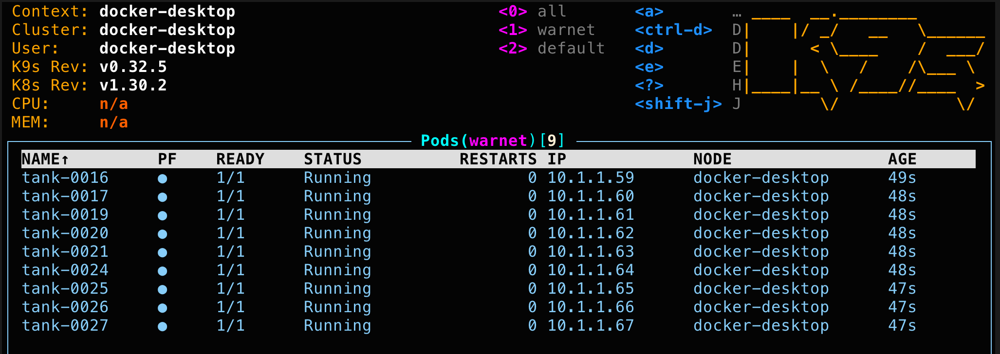
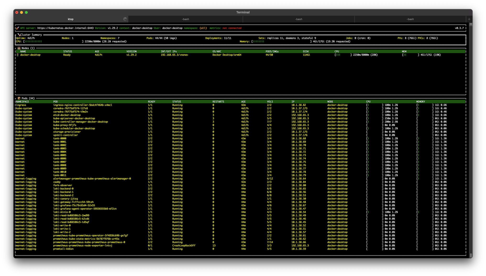
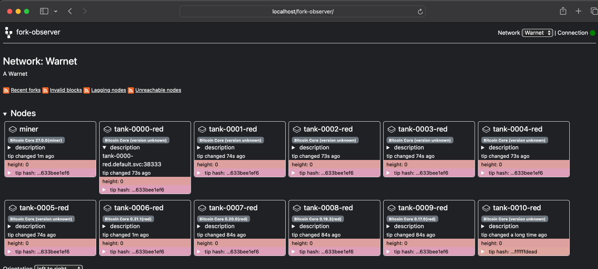

# Warnet: The Battle of Galen Erso


Your mission is to attack Bitcoin Core nodes in a private network
running in a Kubernetes cluster. The private network consists of Bitcoin Core
nodes that are vulnerable to fully-disclosed historical attacks or novel
intentional flaws. A **FAKE** website with blog posts about all types of
vulnerabilities available for exploit on Warnet can be seen here:

https://bitcorncore.org/en/blog/

⚠️ This website is for entertainment purposes only ⚠️

## Terminology

- Tanks: Bitcoin Core nodes running in a Warnet network
- Battlefield: A remote cluster with 100 vulnerable tanks
    - custom signet chain with one miner run by admin
- Scrimmage: A local cluster with only a few vulnerable tanks
    - custom signet chain with OP_TRUE challenge so anyone can generate blocks (like regtest)
- Armada: A small set of tanks running the latest Bitcoin Core release under the attacker's control
- Scenario: A program that deploys to the battlefield to attack the tanks

## Objectives

1. Clone this repo!
2. Install and set up Warnet
3. Create attacks
4. Test attacks locally in scrimmage
5. Attack Bitcoin Core nodes on the battlefield

## Intelligence Brief -- What is Warnet?

Warnet is a system written in Python to deploy, manage, and interact with
Bitcoin p2p networks inside a Kubernetes cluster. The official battlefield
will be a remote cluster with over 100 Bitcoin nodes (referred to as "Tanks")
running on a custom signet chain (where only the network administrator can
generate blocks). Many of these nodes will be old versions of
Bitcoin Core with
[publicly disclosed vulnerabilities](https://bitcoincore.org/en/blog/). There will
also be additional nodes that have been compiled with intentional flaws and
[FAKE disclosures](https://bitcorncore.org/en/blog/)

To help facilitate Tank-attacking strategies on the battlefield, a smaller
12-node network called scrimmage can be run locally by attackers while
developing scenarios. Scrimmage requires running kubernetes locally (either
Docker Desktop or minikube) which is not required to run attacks on the remote
battlefield. Scrimmage also runs on a signet chain with a challenge of `OP_TRUE`
so any node can generate blocks.

### Install Warnet

Documentation for Warnet is available in the repository.

Install into a virtual python environment:

https://github.com/bitcoin-dev-project/warnet/blob/main/docs/install.md#install-warnet

### Setup Warnet

Warnet itself will guide you through the setup process.

> [!TIP]
> **There are several options to carefully choose when setting up Warnet!**
> - You only need to install minikube or docker desktop's kubernetes if you plan to run the scrimmage network locally for experimentation and development.
> - Accessing the remote 100-node signet battlefield does not require a local kubenetes distribution, but will still require installation of `kubectl` and `helm`.
> - The `warnet setup` wizard will install these dependencies for you.
> - If running Docker Desktop, be generous with the amount of resources you assing to it.

#### One Warnet is installed, execute `warnet setup`

Example:

```
(.venv) $ warnet setup

                 ╭───────────────────────────────────╮
                 │  Welcome to Warnet setup          │
                 ╰───────────────────────────────────╯

    Let's find out if your system has what it takes to run Warnet...

[?] Which platform would you like to use?:
 > Minikube
   Docker Desktop
   No Backend (Interacting with remote cluster, see `warnet auth --help`)
```

### Once Warnet is set up in a virtual environemnt, clone this repo!

```
(.venv) $ git clone https://github.com/bitcoin-dev-project/battle-of-galen-erso
(.venv) $ cd battle-of-galen-erso/
```

### Additional tools

#### K9s

Whether you run Kubernetes locally or use the remote cluster, we recommend the
terminal user interface [k9s](https://github.com/derailed/k9s) to monitor
cluster status.



#### ktop

If you want to observe resource usage on a cluster with metrics enabled, you
may want to consider using [ktop](https://github.com/vladimirvivien/ktop)



## Network Operations

### Start and Stop the Network

> [!TIP]
> **This section is only relevant in scrimmage (you are running kubernetes locally)**

You can see the topology of the network which will be deployed, and make
modifications to it by looking at: `networks/scrimmage/network.yaml`
This will also allow you to see which tanks are running which version of
Bitcoin Core.

Deploy the 12-node scrimmage network included in this repository to a local Kubernetes
cluster with the command:

```
warnet deploy ./networks/scrimmage
```

The local network can be shut down with the command:

```
warnet down
```

### Network Reconnaissance

> [!TIP]
> **This section is only relevant in scrimmage (you are running kubernetes locally)**

You can open the web based visualizer with Grafana dashboards and Fork Observer
at by executing the command:

```
warnet dashboard
```

Warnet will get the `localhost` port of the dashboard web server and
open it in your system's default browser.



### Network Communications

> [!TIP]
> **On the battlefield, these commands will only be able to retrieve data from**
> **tanks in your armada. In local scrimmage mode, you will have access to all tanks.**

See the [Warnet documentation](https://github.com/bitcoin-dev-project/warnet/blob/main/docs/warnet.md)
for all available CLI commands to retrieve logs, p2p messages, and other status
information.

#### Examples:
#### Status

```
(.venv) --> warnet status
╭────────────────────── Warnet Overview ───────────────────────╮
│                                                              │
│                        Warnet Status                         │
│ ┏━━━━━━━━━━━┳━━━━━━━━━━━━━━━━━━━━━┳━━━━━━━━━┳━━━━━━━━━━━━━━┓ │
│ ┃ Component ┃ Name                ┃ Status  ┃ Namespace    ┃ │
│ ┡━━━━━━━━━━━╇━━━━━━━━━━━━━━━━━━━━━╇━━━━━━━━━╇━━━━━━━━━━━━━━┩ │
│ │ Tank      │ armada-0            │ running │ wargames-red │ │
│ │ Tank      │ armada-1            │ running │ wargames-red │ │
│ │ Tank      │ armada-2            │ running │ wargames-red │ │
│ │ Scenario  │ No active scenarios │         │              │ │
│ └───────────┴─────────────────────┴─────────┴──────────────┘ │
│                                                              │
╰──────────────────────────────────────────────────────────────╯

Total Tanks: 3 | Active Scenarios: 0
Network connected
```

#### bitcoin-cli
```
(.venv) --> warnet bitcoin rpc armada-0 -getinfo
Chain: signet
Blocks: 0
Headers: 0
Verification progress: 100.0000%
Difficulty: 4.656542373906925e-10

Network: in 0, out 1, total 1
Version: 270000
Time offset (s): 0
Proxies: n/a
Min tx relay fee rate (BTC/kvB): 0.00001000

Warnings: (none)
```

## Ordnance

### Attack Development

The primary method of interacting with the network and mounting an attack is by
deploying a scenario.

A scenario is a Python script written with the same structure and library as
a Bitcoin Core functional test, utilizing a copy of the `test_framework`, which is
[included](/scenarios/test_framework) in this repo and may be modified if necessary.
The primary difference is that the familiar `self.nodes[]` list contains
references to containerized Bitcoin Core nodes running inside the
cluster rather than locally accessible bitcoind processes.

An additional list `self.tanks[str]` is available to address Bitcoin nodes
by their Kubernetes pod name (as opposed to their numerical index).

Objects in `self.nodes[]` and `self.tanks[]` are RPC proxy objects which interpret
all calls as RPC commands to be forwarded to the bitcoin core node.

Example:
```python
self.tanks["armada-0"].getpeerinfo()
```

If you are unfamiliar with the Bitcoin Core RPC interface you can get help directly
from a Bitcoin Core node:

```
(.venv) $ warnet bitcoin rpc armada-0 help
```

There are also several resources online to learn about the available RPC commands:

https://chainquery.com/bitcoin-cli

https://developer.bitcoin.org/reference/rpc/


**The only tanks you as an attacker have RPC access to are in your own armada**

A handful of example scenarios are included in the [`scenarios/`](/scenarios/) directory.
In particular, [`scenarios/reconnaissance.py`](/scenarios/reconnaissance.py) is written with verbose comments
to demonstrate how to execute RPC commands on available nodes, as well as how
to utilize the framework's `P2PInterface` class to send arbitrary messages
to targeted nodes.

Tanks in the kubernetes network have URIs that include a namespace. URIs for all
tanks can be seen in the "description" field in the fork-observer web UI.

Example:
```python
attacker = P2PInterface()
attacker.peer_connect(
    dstaddr=socket.gethostbyname("tank-0000-red.default.svc"),
    dstport=38333,
    net="signet",
    timeout_factor=1
)()
attacker.wait_until(lambda: attacker.is_connected, check_connected=False)

# Create a malicious p2p packet and send...
```

### Attack Deployment

To create an attack modify the existing files in `scenarios/` or create new
ones and deploy them to the network. The `--debug` flag will print the log output
of the scenario back to the terminal, and delete the container when it finishes
running by either success, failure, or interruption by `ctrl-C`

Example:

```
(.venv) --> warnet run scenarios/reconnaissance.py --debug
...
Successfully deployed scenario commander: reconnaissance
Commander pod name: commander-reconnaissance-1727792531
initContainer in pod commander-reconnaissance-1727792531 is ready
Successfully copied data to commander-reconnaissance-1727792531(init):/shared/warnet.json
Successfully copied data to commander-reconnaissance-1727792531(init):/shared/archive.pyz
Successfully uploaded scenario data to commander: reconnaissance
Waiting for commander pod to start...
Reconnaissance Adding TestNode #0 from pod tank-0000 with IP 10.1.38.68
Reconnaissance Adding TestNode #1 from pod tank-0001 with IP 10.1.38.69
Reconnaissance Adding TestNode #2 from pod tank-0002 with IP 10.1.38.70
Reconnaissance Adding TestNode #3 from pod tank-0003 with IP 10.1.38.71
Reconnaissance Adding TestNode #4 from pod tank-0004 with IP 10.1.38.72
Reconnaissance Adding TestNode #5 from pod tank-0005 with IP 10.1.38.73
Reconnaissance Adding TestNode #6 from pod tank-0006 with IP 10.1.38.74
Reconnaissance Adding TestNode #7 from pod tank-0007 with IP 10.1.38.75
Reconnaissance Adding TestNode #8 from pod tank-0008 with IP 10.1.38.76
Reconnaissance Adding TestNode #9 from pod tank-0009 with IP 10.1.38.77
Reconnaissance Adding TestNode #10 from pod tank-0010 with IP 10.1.38.78
Reconnaissance Adding TestNode #11 from pod tank-0011 with IP 10.1.38.79
Reconnaissance User supplied random seed 131260415370612
Reconnaissance PRNG seed is: 131260415370612
Reconnaissance Getting peer info
Reconnaissance tank-0001 /Satoshi:27.0.0/
Reconnaissance tank-0002 /Satoshi:27.0.0/
Reconnaissance tank-0003 /Satoshi:27.0.0/
Reconnaissance tank-0005 /Satoshi:25.1.0/
Reconnaissance 10.1.38.75:59622 /Satoshi:0.21.1/
Reconnaissance tank-0006 /Satoshi:24.2.0/
Reconnaissance tank-0004 /Satoshi:26.0.0/
Reconnaissance 10.1.38.79:36980 /Satoshi:0.16.1/
Reconnaissance 10.1.38.76:40020 /Satoshi:0.20.0/
Reconnaissance tank-0010 /Satoshi:0.17.0/
Reconnaissance tank-0011 /Satoshi:0.16.1/
Reconnaissance Attacking 10.111.179.151:18444
Reconnaissance Got notfound message from 10.111.179.151:18444
Reconnaissance Stopping nodes
Reconnaissance Cleaning up /tmp/bitcoin_func_test_4zh_53n0 on exit
Reconnaissance Tests successful
Deleting pod...
pod "commander-reconnaissance-1727792531" deleted

```

You can also query the scenario with `-- --help` to learn about its arguments.

Example:

```
(.venv) --> warnet run scenarios/miner_std.py -- --help
usage: warnet run /path/to/miner_std.py [options]

Generate blocks over time

options:
  -h, --help           show this help message and exit
  --allnodes           When true, generate blocks from all nodes instead of just nodes[0]
  --interval INTERVAL  Number of seconds between block generation (default 60 seconds)
  --mature             When true, generate 101 blocks ONCE per miner
  --tank TANK          Select one tank by name as the only miner
```

## Rules of Engagement

An attack is considered successful when a target node is no longer in sync with
the most-work chain. This could be the result of:
- An eclipse attack
- An out-of-memory error killing the node process (the nodes are programmed not to restart)
- A CPU denial-of-service preventing the node from verifying new blocks

Attackers will not be able to generate their own blocks on the battlefield
signet chain, but have unlimited permission on their local scrimmage signet network.

## Funds

On the battlefield, only the administrator can generate blocks. They will periodically
run a script that funds everyone's armada nodes with whatever spendable balance
the miner has. That script will ensure every armada node has a wallet called "miner".

> [!TIP]
> Your armada nodes will have a wallet called "miner" with lots of test BTC!


## HINTS

💡Scrimmage is a signet chain, meaning even though the difficulty target is the
minimum, proof of work still matters. For that reason generating blocks may require
more than one attempt.

Try: `warnet deploy scenarios/miner_std.py --tank=miner --interval=1 --debug`

Remember block subsidies will only be spendable after 100 blocks!

💡You may be unfamiliar with the Bitcoin Core functional test framework. To get
some clues about its usage in p2p scenarios, review some of the existing tests!

Examples:
- [send `addr` messages](https://github.com/bitcoin/bitcoin/blob/28.x/test/functional/p2p_addrfetch.py)
- [create orphan transactions](https://github.com/bitcoin/bitcoin/blob/28.x/test/functional/p2p_orphan_handling.py)
- [send invalid blocks](https://github.com/bitcoin/bitcoin/blob/28.x/test/functional/p2p_invalid_block.py)

Also look at the stubbed and example scenarios in the `scenarios` directory for inspiration.

## Run your first attack

We will try to take down the 5k-inv node. To find out which node that is we can use 
forkobserver by using `warnet dashboard` if running Scrimmage locally or using the 
forkobserver URL provided by the administrators for your Battlefield.

On fork-observer, the "description" field will show what version of bitcoin is running. 
Find the 5k-inv node and update `scenarios/my_first_attack_5kinv.py` with the name of this node. 
Look for a variable called `victim`. On  Battlefield you will have been a color to attack 
and locally in Scrimmage there will only be red. The link "disclosing" this particular attack can be found:
[5K Inv Disclosure](https://bitcorncore.org/en/2024/10/23/fake-disclosure-5kinv/).

From the root of this repo, run this scenario with:

`warnet run scencarios/my_first_attack_5kinv.py --debug`

After the 5000 INVs have been sent, you should observe that this node becomes unresponsive on fork-observer.

## On The Battlefield

When you are ready to launch your attack for real, start by "switching context"
from your local cluster to the remote cluster. You will have a config file
provided by the administrator:

```
warnet auth /path/to/battlefield-100-large-kubeconfig.yaml
```

### Switching context back to local / back to battlefield

To see your available contexts run:

```shell
kubectl config get-contexts
```

For local the context you are most likely looking for would be `docker-desktop` or `minikube`. For the Battlefield it will be a longer name.

Switch to that context using:

```shell
kubectl config use-context <context name>
```

Warnet commands will run against whatever is the context currently set in your kubeconfig (as shown using kubectl)

Good luck!
